 

### Prizes!

* ___$500___ first prizes in four categories!!!!
* Additional runner-up prizes, including prizes for new lab users

### How to enter:

1.	Sign up for a Breakerspace lab microscope training (If you’ve already trained, you’re one step ahead!): [breakerspace.mit.edu](https://breakerspace.mit.edu/)
2.	Capture your optical or scanning electron microscope images in the Breakerspace
3.	[Submit your entry here](https://forms.gle/26D7oqJJvAK5cKBG7) by Friday, November 15

### Categories:

* __Most Instructive:__ Images that illustrate concepts important to your discipline and teach someone else about something you’re passionate about
* __Most Challenging:__ Images that require extra effort to prepare or image the sample, such as ion milling, sputter coating, temperature-controlled imaging, video or timelapse capture, and more. Additional documentation of the process is required, more details provided soon
* __Best Optical Microscope Image:__ Artistic or beautiful images captured with the Breakerspace digital optical microscope
* __Best Scanning Electron Microscope (SEM) Image:__ Artistic or beautiful images captured with a scanning electron microscope in the Breakerspace

#### Most instructive:

This category is intended to allow you to share something you are passionate about, while teaching others about it through the image(s) and supporting materials you submit. The entry can be a single image or a series of images, whatever is most appropriate to share the concept, along with detailed captions and other supporting information such as drawings, diagrams, examples of the concept in everyday life, and anything else that helps convey the signficance of the image to your fellow students. 

A winning entry in this category will be judged on the concept being shared, and how integral the image(s) are to explaining the concept. Technical aspects of the captured image (sharpness, contrast, etc.) will weigh more heavily in this category, while more subjective criteria such as aesthetics may be used in the event of a tie, but will not be the primary driver to win this category.

#### Most challenging:

Oftentimes in the lab, use of an instrument such as a microscope to characterize a sample is the final step of a lengthy process needed to prepare the sample. A common sequence of steps to look at the structure of a metallographic or semiconductor sample might involve sectioning, mounting, grinding, polishing, and ion-milling the sample. Only a few minutes might be needed on the microscope, but the true effort to capture that image took multiple hours of work across multiple days. 

This category is created to allow you to share all the effort that went into producing that one final image. Submissions should include photographs and micrographs (images captured on the microscope) of the sample and equipment needed to process it at each stage, along with a brief description of each step of the process and why it is being done, and of course the final image. Images will be judged on technical quality of the final image, and difficulty/quality of completion of the sample preparation process, and how well the supporting materials show the challenges inherent in capturing the final image and how they were overcome. Aesthetic criteria may be used as tie-breakers but will not be the primary criteria used to judge this category of image.

#### Best overall:

Two prizes will be given out in this category, one for the optical microscope and one for the SEM. All images will be considered for this category, with the panel of judges voting on their favorites and the highest vote-getter from each instrument earning the prize.

#### Honorable mention and runner-up prizes:

Some prizes will be reserved for new Breakerspace lab users who sign up for training and submit and image during the contest period. Additional prizes will be awarded for honorable mentions in each category as well as any potential ties. 

### Judging criteria:

A panel of judges will evaluate entries based on the following criteria:

* Technical Merit: Judges will assess technical aspects of the capture such as clarity, focus, depth of field, contrast, and spatial resolution of the image
* Artistic Merit: This is where creativity and aesthetics count. Judges will consider composition, symmetry, and overall visual impact
* Context (as explained in the image caption): The caption should explain the relevance or background of the image. Judges will look for clarity and insight in the description — whether it helps viewers understand the significance of what is being shown. Additional supporting documentation to help convey context may be submitted

### Rules:

* All entrants must be currently enrolled MIT undergraduate students
* All entries must be captured using the microscopes in the DMSE Breakerspace, 8-102a
* Each winner will be eligible for one prize only, though multiple submissions will be accepted

### Deadline:

Submissions are due by Friday, November 15. Winners will be announced by Friday, December 6.

Curious? Ready to explore the microscopic world? Let’s get started!

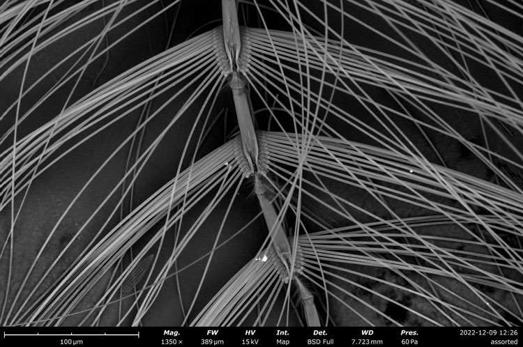
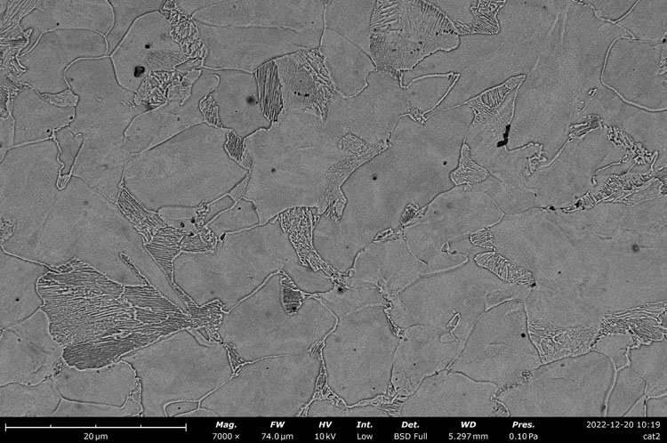
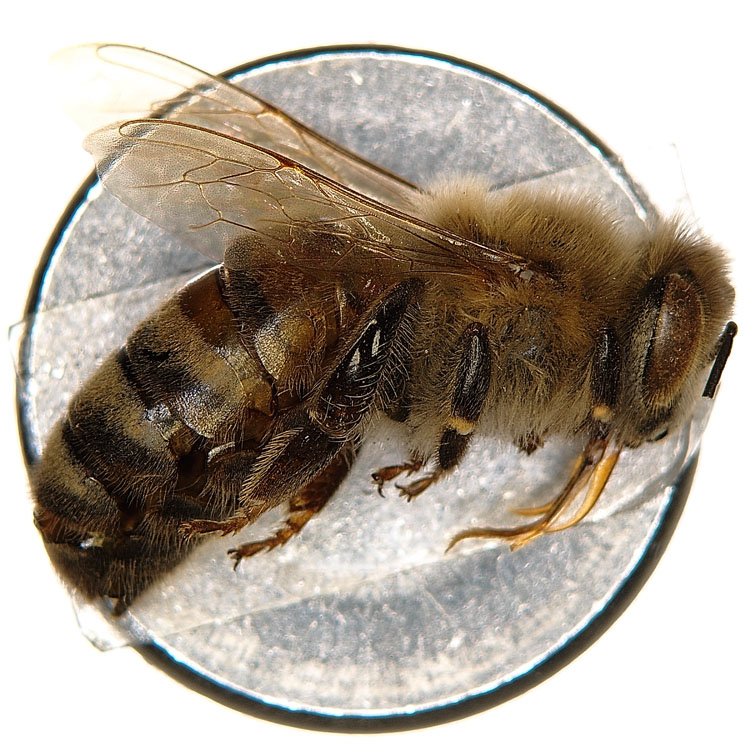

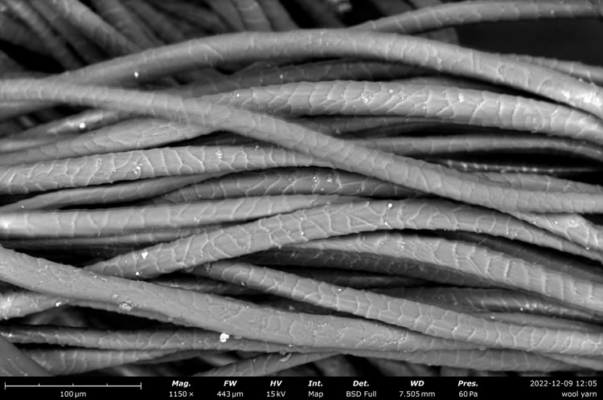
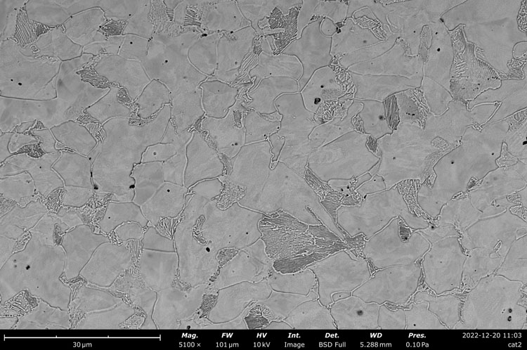
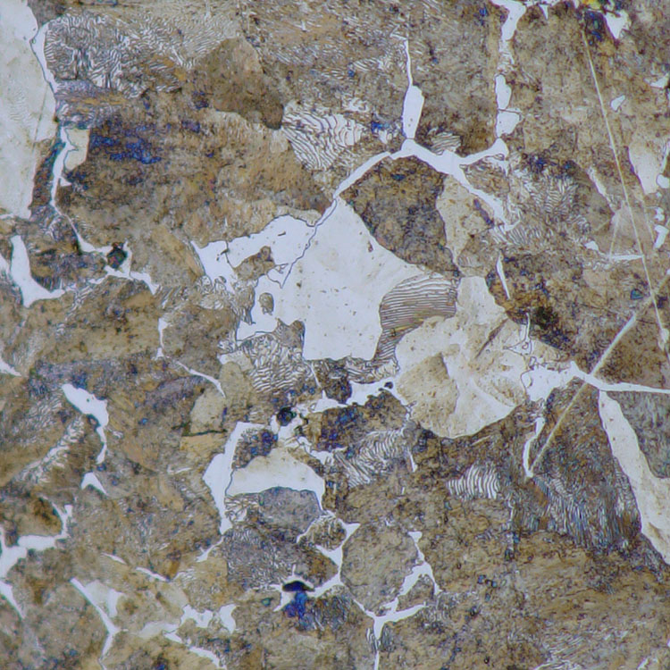

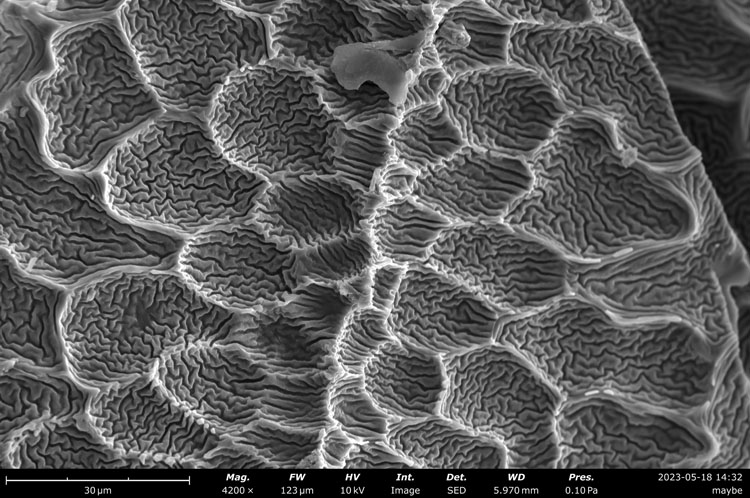
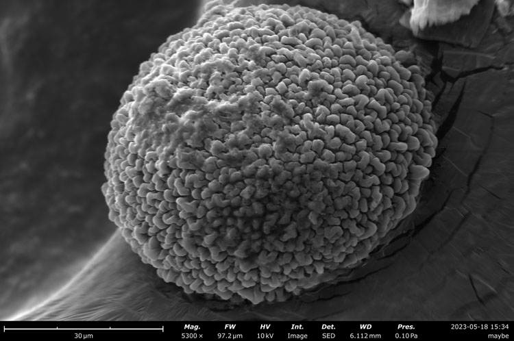
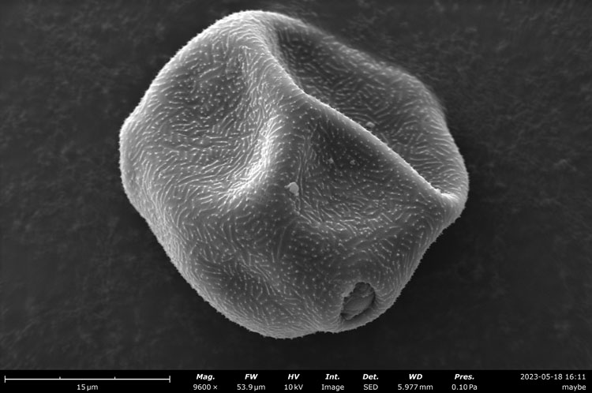
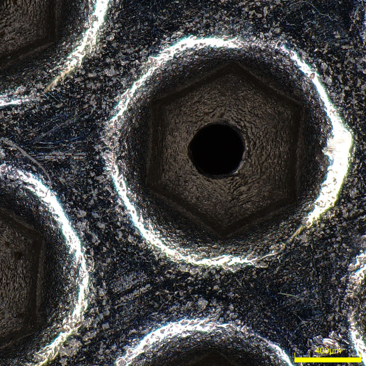

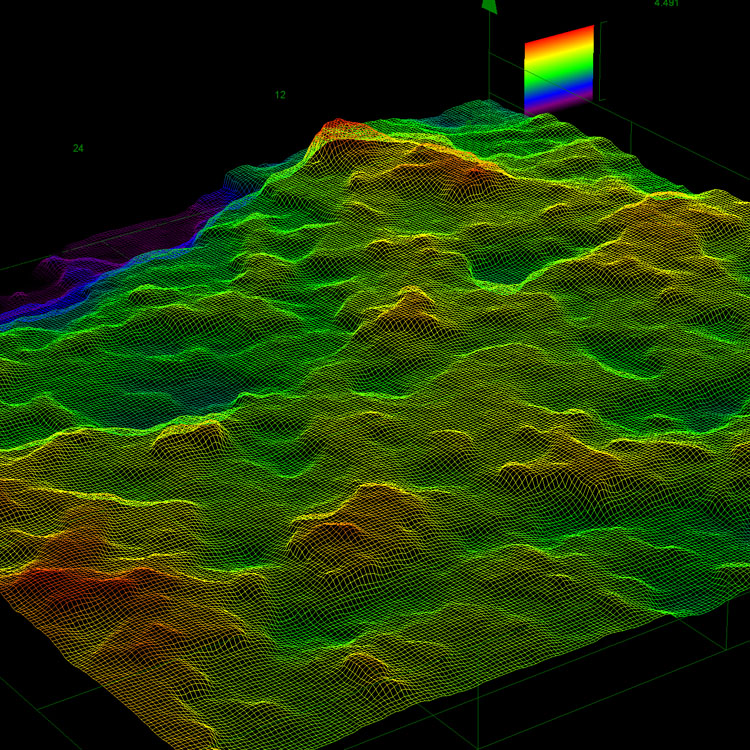
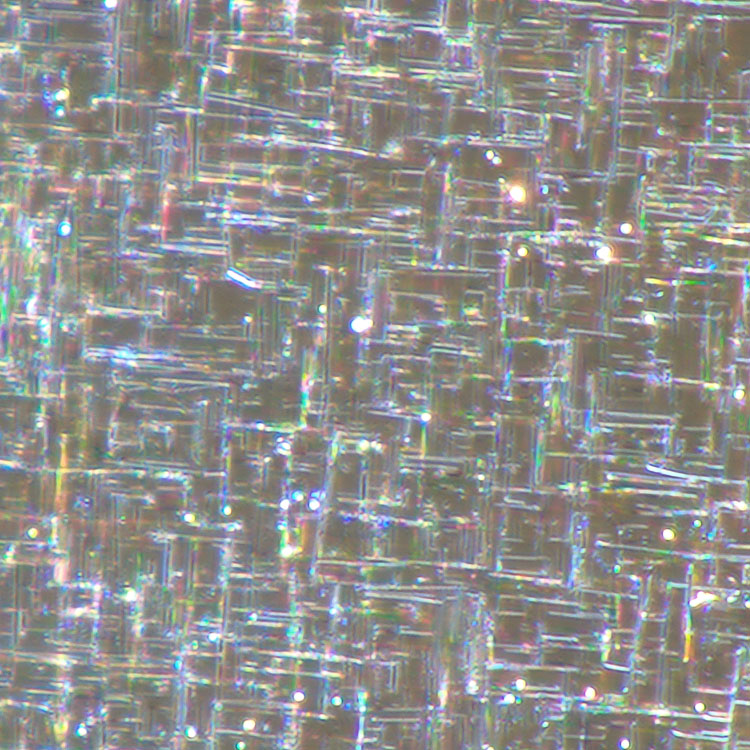
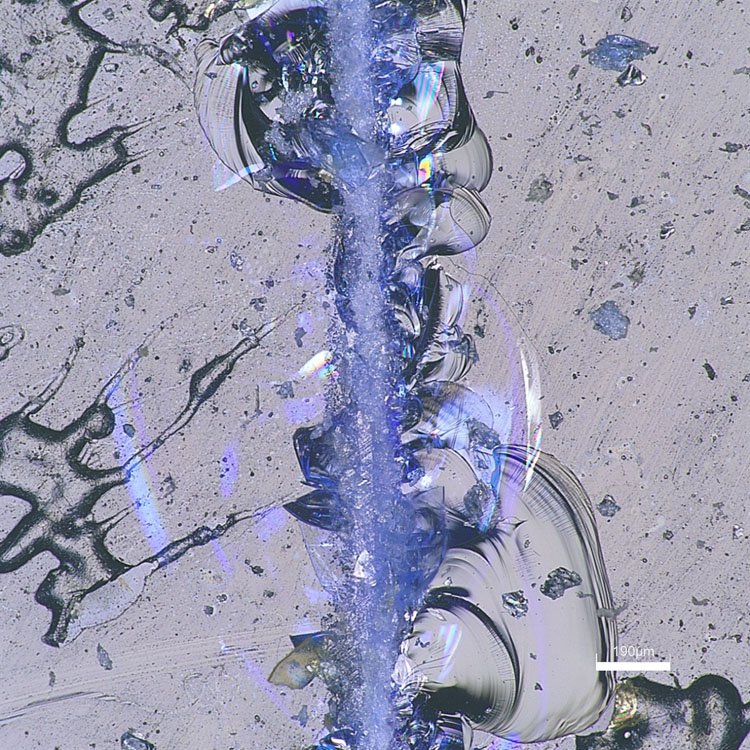

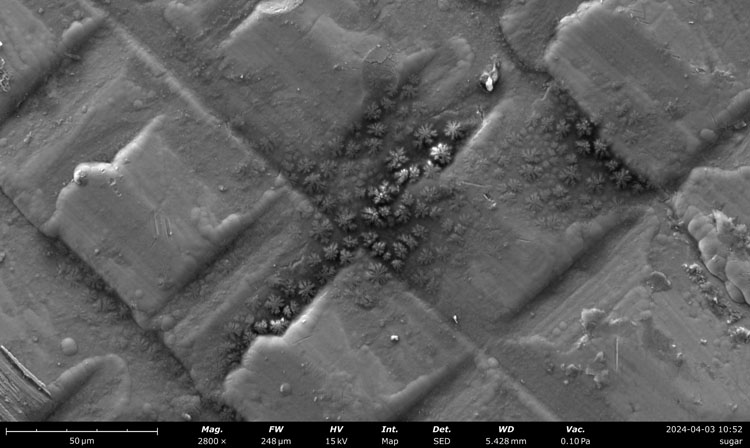

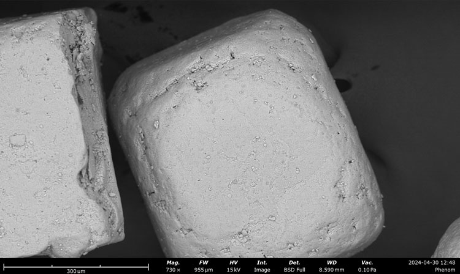
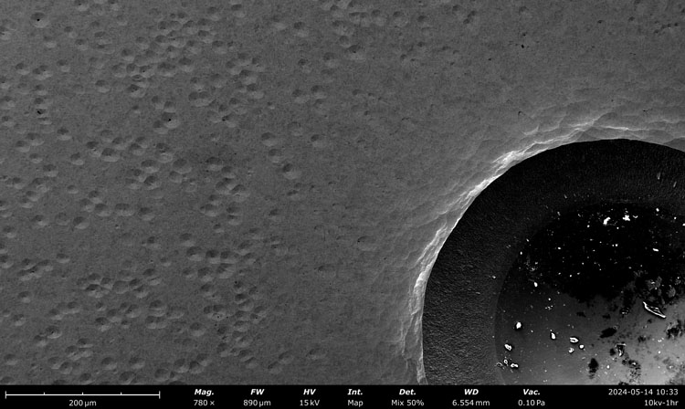
